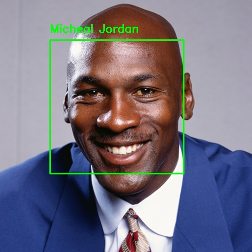
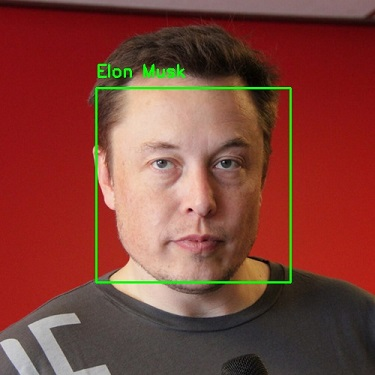
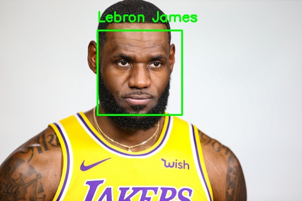

# Face Recognition 

Performs facial recognition by using a trained linear model.

## Overview
* Create an image dataset that a model can be trained on
* Convert the images from the training dataset to 128-D vector
* Train multiple models and select the model with the best score and predictability
* Test classifier by using a piCamera module or a test dataset
___

## Project Components
* Dataset
	* Dataset is divided into 3 components: train, validation, and test.
	* Each folder contains an inner folder with the images of the people desired to be facially recognized
	* Inner folder should be named after the person contained in the images
* Preprocess: Folder containing 2 files
	* encode faces.py: Script converts images into 128-D vectors and stores them into pickle files
	* train model.py: Script trains multiple models on 128-D vectors and selects best model and stores the model into a pickle file
* Results: Contains resulting images 
* main.py: Uses the trained model on a piCamera module and classifies individuals if applicable 
* main_images.py: Uses the trained model on test images stored in dataset and classifies them  
* **NOTE:** the file paths for imported image datasets and exported pickle files must be changed appropriatelyy

## Results
### main_images.py

